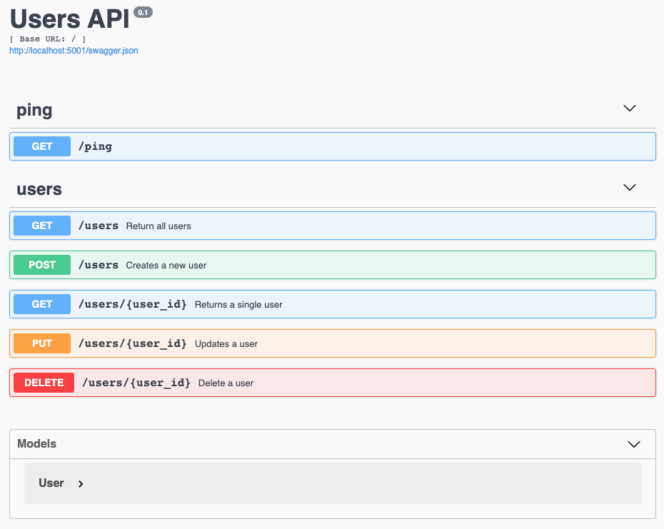

# Flask Docker Template
---

## CLI (no docker)
```shell script
(env)$ export FLASK_APP=project/__init__.py
(env)$ export FLASK_ENV=development
(env)$ python manage.py run
```

## Docker container instructions
* Build and start
```shell script
$ docker-compose build
$ docker-compose up -d
$ docker-compose up -d --build  (build and run)
```
* Create the database 
```shell script
$ docker-compose exec users python manage.py recreate_db
```
* Seed the database
```shell script
$ docker-compose exec users python manage.py seed_db
```
* Run the tests
```shell script
$ docker-compose exec users pytest "project/tests" -p no:warnings
```

* Run the tests with coverage
```shell script
$ docker-compose exec users pytest "project/tests" -p no:warnings --cov="project"
# want to have html version
$ docker-compose exec users pytest "project/tests" -p no:warnings --cov="project" --cov-report html
$ open htmlcov/index.html
```

* Lint
```shell script
$ docker-compose exec users flake8 project
```

* Run Black and isort with check options
```shell script
$ docker-compose exec users black project --check
$ docker-compose exec users /bin/sh -c "isort project/*/*.py" --check-only
```

* Make code changes with Black and isort
```shell script
$ docker-compose exec users black project
$ docker-compose exec users /bin/sh -c "isort project/*/*.py"
```

* Open http://localhost:5001/doc/ for API document(swagger)


### Pytest Tips
```
### normal run
$ docker-compose exec users pytest "project/tests"

### disable warnings
$ docker-compose exec users pytest "project/tests" -p no:warnings

### run only the last failed tests
$ docker-compose exec users pytest "project/tests" --lf

### run only the tests with names that match the string expression
$ docker-compose exec users pytest "project/tests" -k "config and not test_development_config"

### stop the test session after the first failure
$ docker-compose exec users pytest "project/tests" -x

### enter PDB after first failure then end the test session
$ docker-compose exec users pytest "project/tests" -x --pdb

### stop the test run after two failures
$ docker-compose exec users pytest "project/tests" --maxfail=2

### show local variables in tracebacks
$ docker-compose exec users pytest "project/tests" -l

### list the 2 slowest tests
$ docker-compose exec users pytest "project/tests"  --durations=2
```